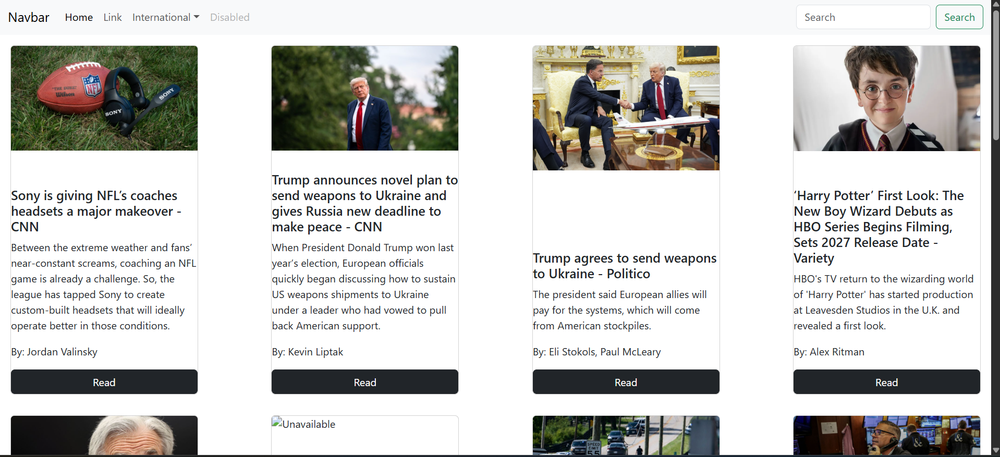

<h1 align="center">📰 Real-Time News App</h1>

  Stay updated with the latest news from around the world — real-time headlines, multi-page navigation, and country-specific news at your fingertips!  
  Built with React and powered by a dynamic news API.

  
  
  
  

---

## 🌟 Features

- 🕒 **Real-time news updates** fetched via a reliable News API  
- 🗂️ **Multi-page navigation** for seamless browsing through news articles  
- 🌍 **Country-specific news** — just click a button to filter news by your favorite country  
- 🔎 **Search functionality** to find news by keywords *(if implemented)*  
- ⚡ **Responsive design** for great experience on desktop & mobile  
- 🌗 **Light & Dark mode toggle** for user preference *(optional)*

---

## 🎥 Preview
 
> 

---

## 🛠️ Tech Stack

- ⚛️ React – Frontend UI framework  
- 🌐 News API – Real-time news data source  
- 🎨 CSS3 – Styling and responsive design  
- 📜 JavaScript (ES6) – Core app logic

---

## 📌 Author

**Daksh Agarwal**  
🔗 [GitHub](https://github.com/dakshagarwal76)

---

## 📜 License

This project is open-source and free to use for learning and personal projects.

---

✨ Feel free to ⭐ the repo if you find it useful!

